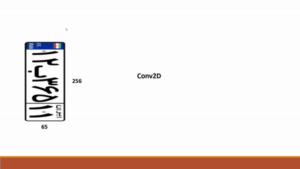
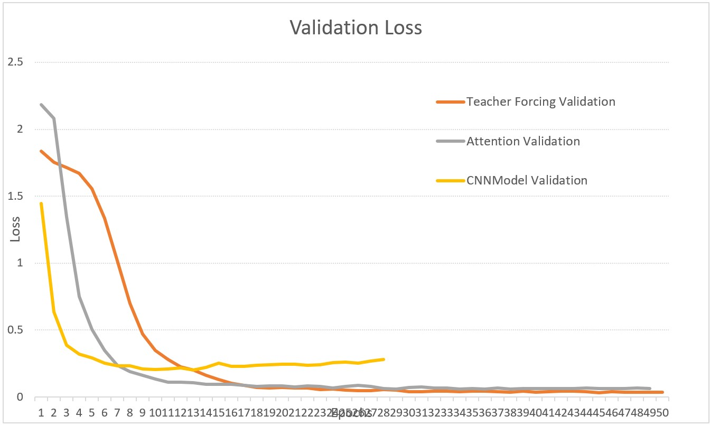
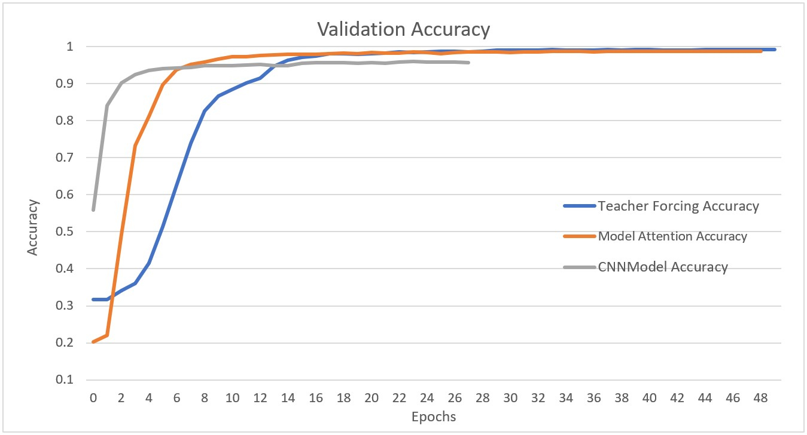

# **Project Title: Plate License Recognition**
### Introduction and Overview
The car license plate recognition project, utilizing artificial intelligence, is an important step towards enhancing urban traffic monitoring and control systems as well as use in parking facilities. This project is developed with the goal of collecting image data from car license plates and processing them to detect and read plate characters. The use of advanced technologies in this project, including deep learning algorithms and specialized AI frameworks, significantly contributes to achieving high accuracy and efficiency of the system.

## Project Overview
##### YOLO
##### CNN & RNN

# Project Steps
#### 1. Data Collection for License Plate Detection
#### 2. Training YOLO Version 8
#### 3. Data Collection for License Plate Reading
#### 4. Building a Plate Generator
#### 5. Labeling Real Plates
#### 6. Building a Model for License Plate Reading
#### 7. Comparing and Improving the Model
#### 8. Final Model Testing
##
### Data Collection for License Plate Detection
Data collection for license plate detection was done manually. This stage included photographing various cars under different lighting and environmental conditions and angles to ensure the trained model could detect plates in various conditions. For data labeling, the CVAT platform was used. On this platform, car plates were manually labeled by drawing a rectangle around the plate, which included two points (top left and bottom right) and determining four points (two points above the plate and two points below it). These precise labels help the model accurately locate the plate in images.
#### [The code that converts cvat format to yolo](https://github.com/SyydMR/PlateLicense/blob/master/Preprocessing/CVAT2Yolo.ipynb)
#### [CVAT Site](https://www.cvat.ai/)

### Training YOLO Version 8
After preparing the data and labeling, the YOLO (You Only Look Once) version 8 model was trained for plate detection. YOLO is one of the most powerful object detection models, known for its high speed and accuracy. Version 8 of this model includes significant improvements in architecture and learning algorithms that help increase accuracy and speed in object detection. The labeled data was fed into the model, which was then trained using this data. During this stage, various model parameters including learning rate, number of training epochs, and batch size were adjusted to achieve the best possible performance.

[Yolo code file](https://github.com/SyydMR/PlateLicense/blob/master/Yolo/Yolo_PoseDetectionPrediction.ipynb)

## Data Collection for License Plate Reading
### Building a Plate Generator
Initially, an artificial data generator was created to produce synthetic data. This plate generator included a set of background-free images containing letters, numbers, and templates used as the main frame of the plate. Each of these images was carefully designed and prepared to form a complete plate when combined. Using these images and a piece of code, a plate generator was designed that could automatically produce various plates with diverse combinations of letters and numbers and save the generated plate as a label along with a random number. This method allowed us to have a highly diverse set of synthetic data for training the model, improving its accuracy and performance in plate detection and reading.
#### [Plate Generator Source](https://github.com/SyydMR/PlateLicense/blob/master/GenerateData/PlateLicenseGeneratorForTrain.ipynb)

### Labeling Real Plates
To increase the model's accuracy and applicability in real conditions, real data labeling was necessary. For this purpose, outputs from the YOLO model, which detected car plates, were used. The YOLO model's output images were processed by a specific code. This code read all images and displayed them one by one. At each stage, the characters and letters on the plate were manually entered, and this information was saved as the image name. This manual labeling process helped us create a highly accurate real data set for training the plate reading models. Precise and correct labeling of this data played a crucial role in improving the final model's accuracy and performance.

## Building a Model for License Plate Reading
Several different models were designed and tested for license plate reading. Initially, a simple CNN model was used to recognize plate letters and numbers. Then, an Encoder-Decoder model was designed, which included CNN as the encoder and RNNs as the decoder, using the Attention mechanism without Teacher Forcing. This model had better capabilities in recognizing sequences of letters and numbers. In the next stage, the previous model was improved using Teacher Forcing and the Attention mechanism. This technique allowed the model not to rely on previous outputs in each prediction step but rather to use real data, significantly increasing the model's accuracy.

## Comparing and Improving the Model
After building and training the models, their results were evaluated and compared using various metrics to assess the models' performance. Models that used the Attention mechanism performed better in reading plates. Using the Teacher Forcing method also significantly increased the models' accuracy. The models were continuously optimized, and various parameters were adjusted to achieve the best possible performance. All three models—CNN, Attention-based, and Attention with Teacher Forcing—were compared in four different charts showing Loss Train, Loss Validation, Accuracy Train, and Accuracy Validation for each.

## Final Model Testing
Finally, the final models were tested on a set of test data that included images the models had not seen before. These data included car plate images under different lighting and environmental conditions to evaluate the models' performance in real conditions.

### [CNN Model](https://github.com/SyydMR/PlateLicense/blob/master/Models/ModelCNN/CNNModel.ipynb)

#### Precision: 0.75
#### Recall: 0.73
#### F1-Score: 0.74
#### Accuracy: 0.92
#### These results show that the CNN model has acceptable capabilities in plate detection and reading but still needs improvement to provide better accuracy and performance.

### [Attention Model](https://github.com/SyydMR/PlateLicense/blob/master/Models/ModelAttention/ModelAttention.ipynb)

#### Precision: 0.82
#### Recall: 0.82
#### F1-Score: 0.82
#### Accuracy: 0.96
#### The results of this model showed that the Attention mechanism significantly improved the model's accuracy and efficiency in plate detection and reading, highlighting the advantage of using this technique in modeling.

### [Attention with Teacher Forcing](https://github.com/SyydMR/PlateLicense/blob/master/Models/ModelTForcingAttention/Model.ipynb)

#### Precision: 0.86
#### Recall: 0.86
#### F1-Score: 0.86
#### Accuracy: 0.97
#### These results indicate that using Teacher Forcing maximized the model's accuracy and efficiency, making the final model with this method the best-performing one among all tested models.

The results demonstrated that the models are capable of detecting and reading car plates with high accuracy. The models' performance was evaluated using various metrics, and the final model with the best accuracy and efficiency was selected. The selected model successfully detected and read car plates under various conditions, indicating the project's success in achieving its goals.

#### [Comparing Models](https://github.com/SyydMR/PlateLicense/blob/master/TestModels/%20ModelEvaluation.ipynb)

## Conclusion
The car license plate detection and reading project, using advanced artificial intelligence and deep learning techniques, achieved very satisfactory results. Various models tested in this project each performed acceptably under different conditions. However, the Attention-based model using the Teacher Forcing method showed the best results, offering high accuracy and efficiency in plate detection and reading. This project demonstrated that using advanced techniques can significantly enhance traffic monitoring and management systems, helping reduce traffic violations.

